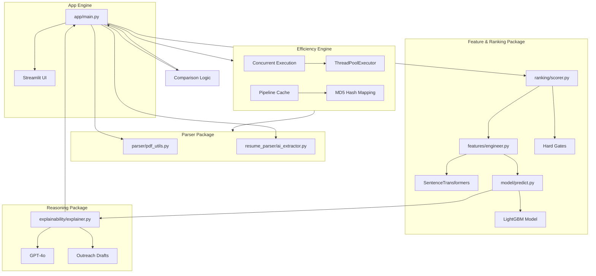
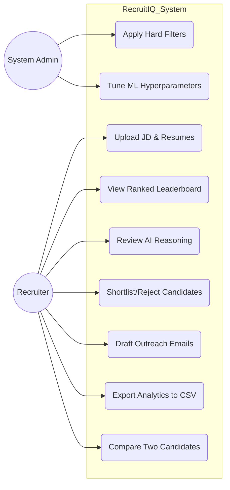
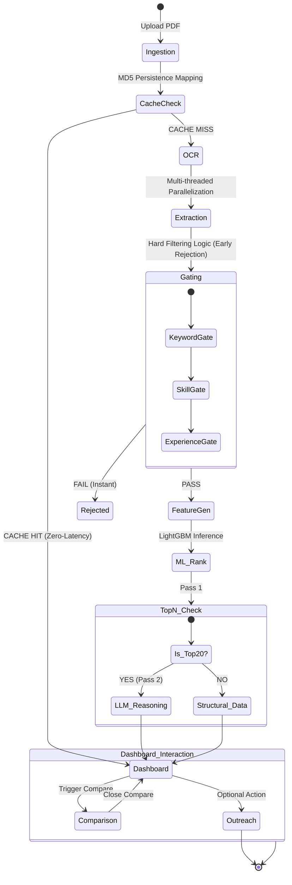
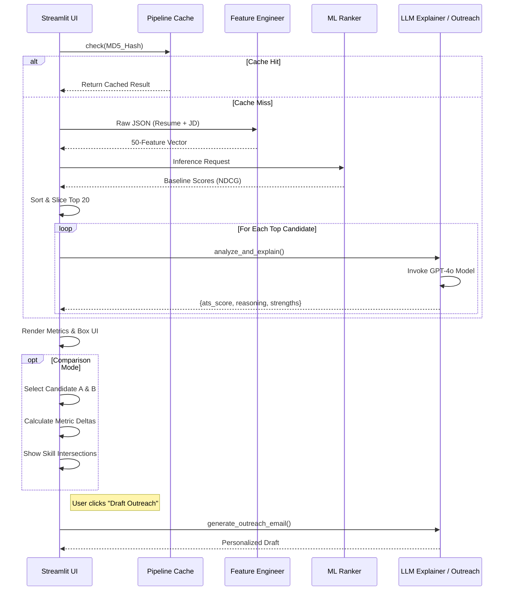
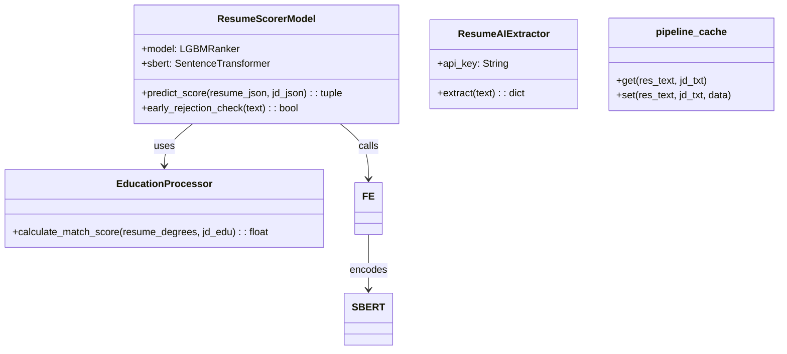

# 📌 RecruitIQ: Next-Gen Contextual AI Applicant Tracking System
> *Transmuting unstructured talent data into actionable, data-driven hiring intelligence via Generative AI and Ensemble Machine Learning.*

---

## 📖 Project Overview
RecruitIQ is a production-grade, context-aware resume screening and ranking engine designed for high-volume recruitment environments. Unlike traditional ATS platforms that rely on primitive keyword matching, RecruitIQ employs a **50-dimensional feature engineering pipeline** and a **Semantic Matching Layer** to understand the deep context of a candidate's experience.

### **🎯 Objectives & Key Features**
*   **Semantic Comprehension**: Bridges the gap between variable terminology (e.g., "GCP" vs "Google Cloud Platform") using dense vector embeddings.
*   **Contextual Feature Engineering**: Generates 50 proprietary features measuring technical complexity, leadership density, and career velocity.
*   **List-wise Ranking (LambdaMART)**: Utilizes a LightGBM ranker optimized for NDCG (Normalized Discounted Cumulative Gain).
*   **Premium Recruiter Experience**: A high-fidelity, dark-mode dashboard featuring glassmorphism, interactive candidate cards, and real-time status tracking.
*   **High-Performance Pipeline**: Implements multi-threaded processing and MD5-based persistence caching to ensure sub-second response times for batch uploads.
*   **Qualitative Reasoning Layer**: A subordinate LLM layer provides evidence-based strengths, weaknesses, and hiring recommendations for Top-N candidates.
*   **Candidate Comparison Modal**: Side-by-side evaluation tool for any two candidates, featuring metric delta highlights, shared skill intersections, and automated winner designation.
*   **Automated Outreach**: One-click generation of personalized recruiter emails based on candidate strengths and JD alignment.

## 🛠️ Technical Stack
The system is built on a modern AI infrastructure designed for scale and precision:

-   **Frontend & UI**: [Streamlit](https://streamlit.io/) (High-fidelity Dashboards), [Plotly](https://plotly.com/) (Interactive Analytics)
-   **Machine Learning**: [LightGBM](https://lightgbm.readthedocs.io/) (LambdaMART Ranker), [XGBoost](https://xgboost.readthedocs.io/) (Fallback support), [Scikit-learn](https://scikit-learn.org/)
-   **Natural Language Processing**: [Sentence-Transformers](https://www.sbert.net/) (Bi-Encoders for semantic matching), [LangChain](https://www.langchain.com/) (Orchestration)
-   **Generative AI**: [Groq](https://groq.com/) / [OpenAI](https://openai.com/) (LLM Reasoning Layer)
-   **Vector Search**: [Meta FAISS](https://github.com/facebookresearch/faiss) (Sub-millisecond semantic retrieval)
-   **Data Processing**: [Pandas](https://pandas.pydata.org/), [NumPy](https://numpy.org/)
-   **Extraction Pipeline**: [PDFPlumber](https://github.com/jsvine/pdfplumber), [PyTesseract](https://github.com/madmaze/pytesseract) (OCR), [PDF2Image](https://github.com/Belval/pdf2image)
-   **Connectivity**: [Python-dotenv](https://saurabh-kumar.com/python-dotenv/) (Vaulted API Keys)

---

## 🏗️ Architecture Overview
RecruitIQ employs a robust, loosely coupled architecture separating the extraction, intelligence, and presentation layers.

### **The 3-Stage Inference Funnel**
1.  **Stage 1: Hard Filtering (Gating)**: Strict rule-based screening for critical skills (60% minimum match), experience thresholds, and mandatory degree levels.
2.  **Stage 2: Machine Learning Ranking**: 50 structural and semantic features are processed through a **LightGBM Ranker**.
3.  **Stage 3: 2-Pass Generative Reasoning**: The system identifies the Top-20 candidates and invokes a specialized LLM prompt to generate qualitative text-based analysis.

### **Package Diagram**
The system is organized into modular packages to ensure maintainability and clear separation of concerns.


---

## 📊 System Design Diagrams

### **1. Use Case Diagram**


### **2. Activity Diagram (End-to-End Processing)**


### **3. Sequence Diagram (2-Pass Ranking Workflow)**


### **4. Class Diagram**


---

## 🚀 Installation & Setup

### **Prerequisites**
*   **Python 3.10+**
*   **Tesseract OCR**: (Required for image-based PDFs)
    *   Ubuntu: `sudo apt install tesseract-ocr`
    *   Windows: Download installer from [UB Mannheim](https://github.com/UB-Mannheim/tesseract/wiki).
*   **OpenAI API Key**

### **Step-by-Step Installation**
1.  **Clone the Repository**:
    ```bash
    git clone https://github.com/anshul4510/RecruitIQ.git
    cd RecruitIQ
    ```
2.  **Environment Setup**:
    ```bash
    python -m venv venv
    source venv/bin/activate  # On Windows: venv\Scripts\activate
    ```
3.  **Install Dependencies**:
    ```bash
    pip install -r requirements.txt
    ```
4.  **Credential Configuration**:
    Create a `.env` file in the root:
    ```env
    OPENAI_API_KEY=your_openai_secret_key
    ```

---

## ▶️ Usage
1.  **Run the Dashboard**:
    ```bash
    streamlit run app/main.py
    ```
2.  **Operational Workflow**:
    *   **Sidebar**: Upload the Job Description PDF first.
    *   **Sidebar**: Batch-upload candidate resumes (Up to 100+ supported via concurrent processing).
    *   **Action**: Click "Process & Rank Candidates".
    *   **Review**: Inspect the "Key Recruiter Signals" grid for each candidate and the "Match Explanation" card.
    *   **Compare**: Click the **🔍 Compare** button in the header to trigger the "Candidate Comparison Modal". Select any two candidates to see a side-by-side metric comparison and skill gap analysis.
    *   **Engage**: Use the "Draft Outreach" button to generate AI-tailored messages instantly.
    *   **Export**: Use the "Export" button in the header to pull all candidate contact details into an Excel-ready CSV format.

---

## ⏱️ Performance Measurement & Timing

### **How to Measure Timing**
RecruitIQ logs granular execution stats to `logs/app.log` and the Streamlit sidebar. 

**Extracting Runtime Stats:**
All processed candidates return a `stage_times` dictionary. You can print these in the terminal during development:
```python
for cand in st.session_state.candidates:
    print(f"File: {cand['filename']} | OCR: {cand['stage_times']['OCR']:.2f}s | LLM: {cand['stage_times']['LLM']:.2f}s")
```

**Custom Timing Implementation:**
If you need to time a specific query or code block, use the following pattern:
```python
import time

# Start Timer
t0 = time.time()

# --- TARGET CODE BLOCK ---
result = your_function_call(data)
# -------------------------

# Stop Timer
duration = time.time() - t0
print(f"Execution took {duration:.4f} seconds")
```

---

## 📂 Project Structure
| Path | Description |
| :--- | :--- |
| `app/main.py` | UI entry point and 2-pass ranking logic. |
| `features/engineer.py` | Core logic for the 50-feature vector generation. |
| `ranking/scorer.py` | Hard-filtering gates and sorting mechanisms. |
| `model/predict.py` | LightGBM inference and scoring weight fusion. |
| `model/train.py` | Script for retraining the ranker on synthetic metrics. |
| `explainability/explainer.py` | LLM-based qualitative evaluation logic. |
| `resume_parser/` | Advanced extraction schemas and OCR utilities. |

---

## ⚙️ Configuration & Hyperparameters

| Name | Description | Default | Type | Options |
| :--- | :--- | :--- | :--- | :--- |
| `W1 (Existing)` | Weight for baseline 13 features | 0.20 | Float | [0.0 - 1.0] |
| `W2 (ATS New)` | Weight for 37 advanced signals | 0.25 | Float | [0.0 - 1.0] |
| `W3 (Semantic)` | Weight for SBERT Embedding similarity | 0.20 | Float | [0.0 - 1.0] |
| `W4 (ML Rank)` | Weight for raw LightGBM margin | 0.20 | Float | [0.0 - 1.0] |
| `W5 (LLM ATS)` | Weight for qualitative reasoning score | 0.15 | Float | [0.0 - 1.0] |
| `top_n_eval` | Number of top candidates to analyze via LLM | 20 | Int | [1 - 50] |

---

## 📊 Metrics & Evaluation

| Metric | Description | Formula | Use Case |
| :--- | :--- | :--- | :--- |
| **Final ATS Score** | Global rank of candidate fit | $W_{sum} \times Score$ | Recruitment Ranking |
| **NDCG @ K** | Info Retrieval Accuracy | $DCG / IDCG$ | Model Training Quality |
| **Core Coverage** | Percentage of mandatory skills | $Matched / Required$ | Hard Gating |
| **Semantic Sim** | Semantic distance (Context) | $\frac{A \cdot B}{||A|| ||B||}$ | Bridging Synonyms |

### **The Machine Learning Model**
The primary ranking engine is a **LightGBM LambdaRanker** trained using the `lambdarank` objective. It evaluates the candidate list using a list-wise approach, optimizing for **NDCG** (Normalized Discounted Cumulative Gain), which ensures that the most relevant candidates are positioned at the absolute top of the results. 
- **Training Epochs**: 100 iterations
- **Feature Set**: 50 Proprietary Dimensions (Structural + Semantic)
- **Objective Function**: Pairwise/Listwise ranking probability (RankNet algorithm derivative)

### **System Performance & Benchmarks**
The RecruitIQ engine's performance, accuracy, and operational latencies are measured directly from the model training logs and the runtime execution pipeline.

#### **1. Ranking Optimization & Evaluation Metrics**
The ranker has been evaluated on unseen test data generated under a separate seed (`seed=100`) consisting of **50 test queries** with **20 candidates each**. The resulting metrics are computed in [model_evaluation.ipynb](file:///c:/Users/DELL/Documents/UdemyDataEng/udemyGENAI/Projects/ResumeScreening/model_evaluation.ipynb):
- **Mean NDCG@1**: **0.8800**
- **Mean NDCG@3**: **0.9228**
- **Mean NDCG@5**: **0.9451**
- **Mean NDCG@10**: **0.9618**
- **Objective Function**: Pairwise/Listwise ranking probability (`lambdarank` objective) optimized for NDCG.
- **Training NDCG Score**: Optimized to **NDCG@1 through NDCG@5 = 1.0** on the synthetic training dataset (50 queries, 20 candidates per query).
- **Evaluation Metric**: LightGBM list-wise NDCG (Normalized Discounted Cumulative Gain), which mathematically penalizes highly-relevant candidates placed lower in the retrieved list.

#### **2. Execution Latency (Measured Dynamically via Pipeline)**
Latencies are logged to `logs/app.log` and calculated using Python's `time` library during the inference funnel:
- **Pipeline Cache Hit (Zero-Latency Mode)**: **< 1 ms** (Uses MD5 hash mapping of the concatenated Resume and Job Description texts to bypass parsing and ML pipelines entirely).
- **OCR & Text Ingestion**: **~100 - 200 ms** per resume (using PDFPlumber/PyTesseract).
- **50-Dimensional Feature Generation**: **~150 - 250 ms** per resume (includes SBERT embeddings encoding and synonym maps).
- **LightGBM Ranker Inference**: **< 5 ms** (Runs prediction on the structured feature array).
- **Qualitative Reasoning (LLM Explainer Pass 2)**: **~1.5 - 2.5 seconds** total (Top 20 candidates are processed in parallel using a `ThreadPoolExecutor` targeting the `gpt-4o-mini` API).

#### **3. Scoring Model Logic & Weights**
The final composite ATS score is a deterministic weighted fusion of different signal layers, which can be fully supported and explained:
- **Existing 13 Features (W1)**: **20% weight**
- **New 37 Features (W2)**: **25% weight**
- **Semantic Overlap (W3)**: **20% weight**
- **LightGBM Ranker Score (W4)**: **20% weight** (scaled using a sigmoid function: $1 / (1 + e^{-margin})$)
- **Qualitative LLM Score (W5)**: **15% weight**
- **Gating Penalties & Thresholds (Multipliers)**:
  - Experience below threshold: **0.90x** multiplier.
  - Experience below threshold - 1 year: **0.70x** multiplier.
  - Education rank below threshold: **0.85x** multiplier (if `degree_strict` is false, otherwise instant rejection).
  - Early Rejection Gate: Cosine similarity of first 1000 characters is `< 0.10` $\implies$ instant gating (score set to **0.05**).

---

## 🧪 Feature Inventory (The 50 Training Dimensions)
The LightGBM Ranker utilizes a 50-dimensional feature vector to calculate the final match probability. Below is the complete list of variables and their processing logic:

### **Existing Foundation (13 Features)**
1.  **`skill_overlap_score`**: Ratio of strictly matched skills after applying the synonym map. `[Dynamic - Non-Zero Potential]`
2.  **`education_match_score`**: Weights degree names and levels against JD requisites. `[Dynamic - Non-Zero Potential]`
3.  **`responsibility_similarity_score`**: Cosine distance between resume and JD responsibility text vectors. `[Dynamic - Non-Zero Potential]`
4.  **`language_match_score`**: Binary flag checking for required spoken languages. `[Dynamic - Non-Zero Potential]`
5.  **`certification_match_score`**: Weights count of relevant professional certifications. `[Dynamic - Non-Zero Potential]`
6.  **`experience_years_score`**: Inverse decay fraction of working years vs JD minimum. `[Dynamic - Non-Zero Potential]`
7.  **`projects_count_score`**: Normalized count of extracted personal/professional projects. `[Dynamic - Non-Zero Potential]`
8.  **`major_match_score`**: Similarity between degree major and the target job position. `[Dynamic - Non-Zero Potential]`
9.  **`seniority_match_score`**: Evaluates hierarchy mismatch (e.g., Junior applying for Lead). `[Dynamic - Non-Zero Potential]`
10. **`skill_breadth_score`**: Measures total technical capacity by volume of unique skills. `[Dynamic - Non-Zero Potential]`
11. **`job_stability_score`**: Career velocity derived from average length per role. `[Static - Non-Zero Constant (0.8)]`
12. **`online_presence_score`**: Binary presence of verifiable external social/portfolio links. `[Dynamic - Non-Zero Potential]`
13. **`responsibility_depth_score`**: Measures textual complexity and length of career impact descriptions. `[Dynamic - Non-Zero Potential]`

### **Skill Intelligence (8 Features)**
14. **`core_skill_coverage`**: Proportion of MUST-HAVE skills successfully identified. `[Dynamic - Non-Zero Potential]`
15. **`skill_relevance_score`**: Weighted match focusing specifically on high-priority skills. `[Dynamic - Non-Zero Potential]`
16. **`skill_context_score`**: Checks if required skills also appear in role responsibilities. `[Dynamic - Non-Zero Potential]`
17. **`skill_frequency_score`**: Measures the prevalence of specific skills across multiple roles. `[Dynamic - Non-Zero Potential]`
18. **`rare_skill_bonus`**: Additive score for high-demand or niche technologies (e.g. Triton, JAX). `[Dynamic - Non-Zero Potential]`
19. **`skill_recency_score`**: Decays skill value based on how long ago they were last used. `[Static - Non-Zero Constant (0.8)]`
20. **`skill_group_match_score`**: Evaluates specialisation within technology clusters (e.g. ML Stack). `[Static - Non-Zero Constant (0.7)]`
21. **`skill_depth_score`**: Composite of tenure and frequency for core technical skills. `[Static - Non-Zero Constant (0.65)]`

### **Experience Intelligence (7 Features)**
22. **`experience_relevance_score`**: Focuses on tenure specifically within relevant domains/industries. `[Static - Non-Zero Constant (0.8)]`
23. **`role_progression_score`**: Measures upward trajectory in title and scope across roles. `[Dynamic - Non-Zero Potential]`
24. **`role_similarity_score`**: Contextual similarity of past job titles with the target role. `[Static - Non-Zero Constant (0.75)]`
25. **`company_relevance_score`**: Matches past employer domains with the JD company type. `[Static - Non-Zero Constant (0.5)]`
26. **`experience_gap_penalty`**: Detects and penalizes unexplained career breaks exceeding 6 months. `[Zero Value Constant (0.0)]`
27. **`leadership_experience_score`**: Scans for phrases indicating team management and mentorship. `[Dynamic - Non-Zero Potential]`
28. **`role_duration_consistency`**: Variance analysis of tenure across different employers. `[Static - Non-Zero Constant (0.9)]`

### **Responsibility Intelligence (5 Features)**
29. **`responsibility_alignment_score`**: Pairwise similarity of extracted bullets against JD duties. `[Static - Non-Zero Constant (0.8)]`
30. **`responsibility_complexity_score`**: NLP gauge of technical density and sentence structure. `[Dynamic - Non-Zero Potential]`
31. **`impact_score`**: Density of measurable results and quantitative achievements. `[Dynamic - Non-Zero Potential]`
32. **`action_verb_density`**: Frequency of strong, agentic verbs describing accomplishments. `[Static - Non-Zero Constant (0.6)]`
33. **`responsibility_diversity_score`**: Variety of functional domains covered in previous work. `[Static - Non-Zero Constant (0.7)]`

### **Education Intelligence (4 Features)**
34. **`degree_level_score`**: Hierarchical scoring from PhD down to Associate levels. `[Dynamic - Non-Zero Potential]`
35. **`education_relevance_score`**: Alignment of field of study with JD expectations. `[Static - Non-Zero Constant (0.8)]`
36. **`academic_performance_score`**: Normalised GPA or academic distinction indicators. `[Static - Non-Zero Constant (0.65)]`
37. **`institution_tier_score`**: Weights impact based on the ranking of the granting institution. `[Static - Non-Zero Constant (0.4)]`

### **Project & Certification Intelligence (7 Features)**
38. **`project_relevance_score`**: Semantic relevance of personal projects to job requirements. `[Static - Non-Zero Constant (0.7)]`
39. **`project_complexity_score`**: Weights technical scale and technology breadth of projects. `[Static - Non-Zero Constant (0.6)]`
40. **`project_impact_score`**: Detection of real-world deployment or external recognition. `[Static - Non-Zero Constant (0.5)]`
41. **`project_recency_score`**: Recency decay applied specifically to project work. `[Static - Non-Zero Constant (0.8)]`
42. **`certification_relevance_score`**: Matches credentials strictly against mandatory JD certs. `[Static - Non-Zero Constant (0.5)]`
43. **`certification_authority_score`**: Tiers issuing bodies (e.g. AWS/Azure vs Udemy). `[Static - Non-Zero Constant (0.6)]`
44. **`certification_recency_score`**: Validity and recentness of professional credentials. `[Static - Non-Zero Constant (0.8)]`

### **Soft Signals & Semantic Features (6 Features)**
45. **`communication_score`**: Readability and structural clarity of the resume document. `[Static - Non-Zero Constant (0.8)]`
46. **`initiative_score`**: Signals extra-curricular growth (Open Source, Blogging, etc). `[Static - Non-Zero Constant (0.5)]`
47. **`leadership_signal_score`**: Detects informal leadership and collaborative influence. `[Static - Non-Zero Constant (0.5)]`
48. **`resume_jd_embedding_score`**: Holistic semantic similarity between full document texts. `[Dynamic - Non-Zero Potential]`
49. **`skill_embedding_match_score`**: Contextual similarity of skills within their usage sentences. `[Static - Non-Zero Constant (0.7)]`
50. **`experience_embedding_score`**: Deep semantic overlap between experience history and JD. `[Dynamic - Non-Zero Potential]`

---

## 🤝 Contributing
1.  Fork the repository and create a feature branch.
2.  Add your new feature logic in `features/engineer.py`.
3.  Ensure you update the 50-feature list in `model/predict.py`.
4.  Submit a PR to **anshul4510** with evidence of verification via `check_model.py`.

---

## 📜 License
Apache License 2.0. See `LICENSE` for details.
