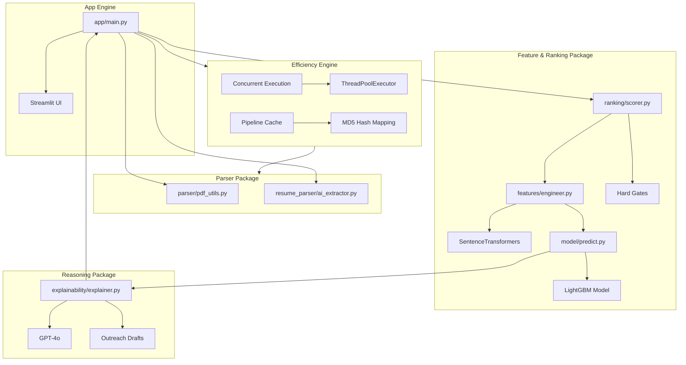
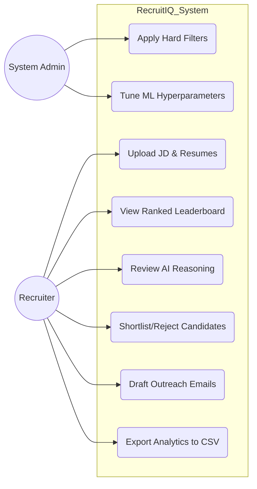
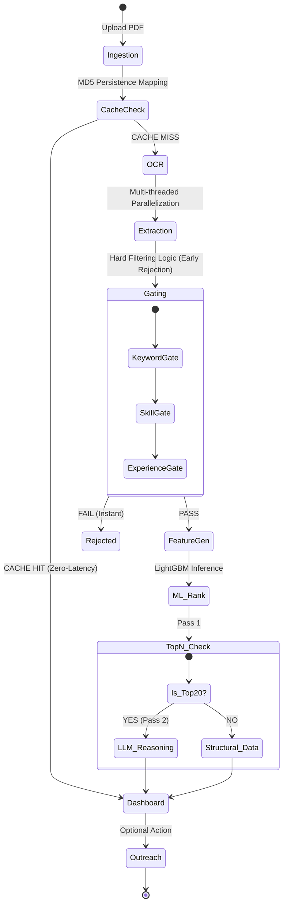
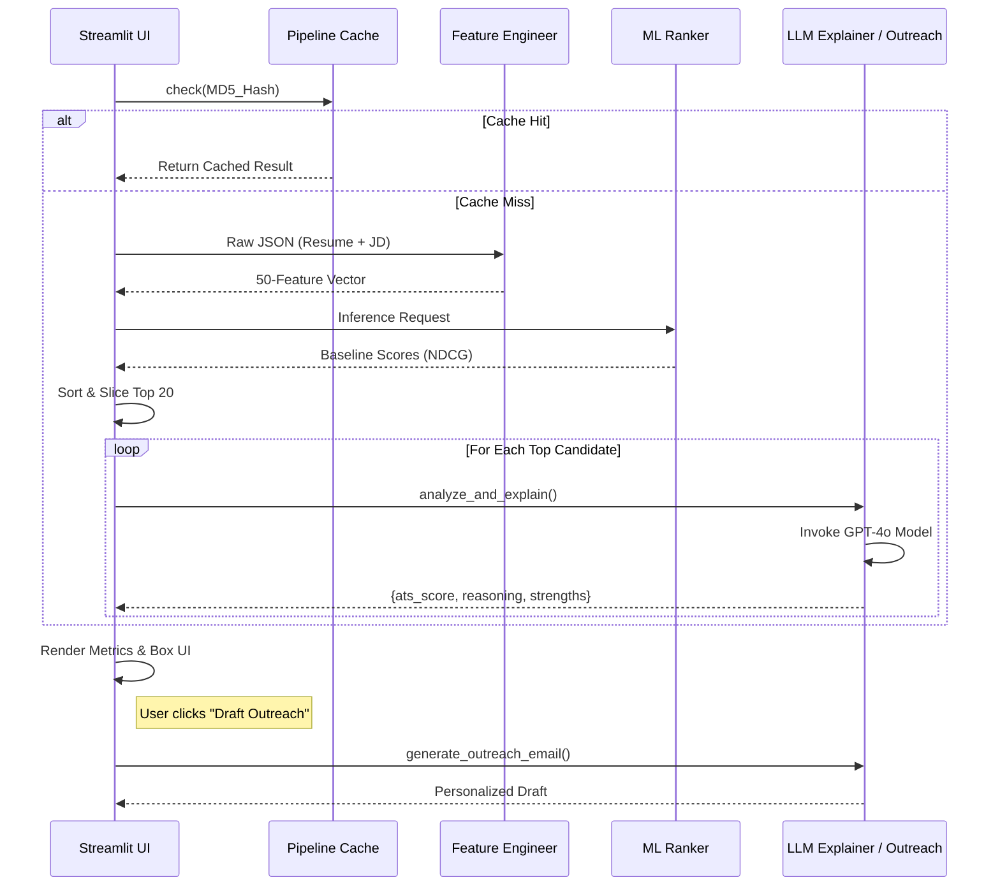
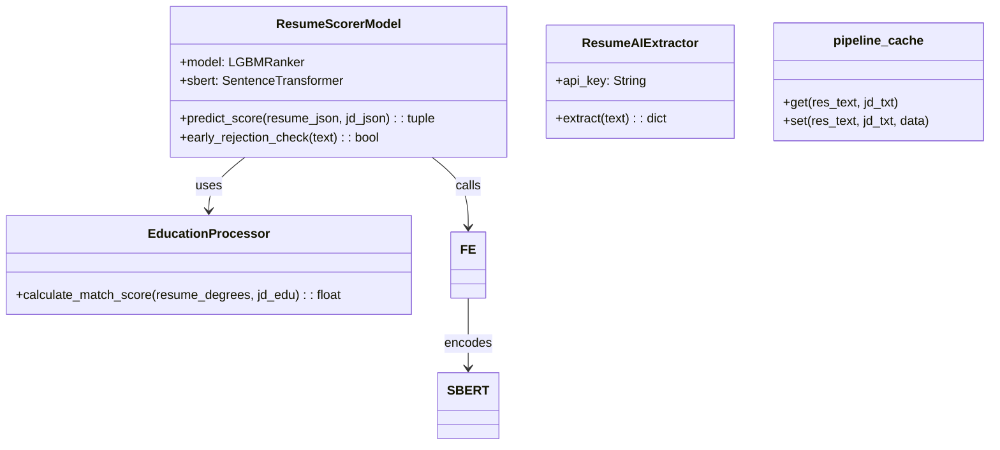

# 📌 RecruitIQ: Next-Gen Contextual AI Applicant Tracking System
> *Transmuting unstructured talent data into actionable, data-driven hiring intelligence via Generative AI and Ensemble Machine Learning.*

---

## 📖 Project Overview
RecruitIQ is a production-grade, context-aware resume screening and ranking engine designed for high-volume recruitment environments. Unlike traditional ATS platforms that rely on primitive keyword matching, RecruitIQ employs a **50-dimensional feature engineering pipeline** and a **Semantic Matching Layer** to understand the deep context of a candidate's experience.

### **🎯 Objectives & Key Features**
*   **Semantic Comprehension**: Bridges the gap between variable terminology (e.g., "GCP" vs "Google Cloud Platform") using dense vector embeddings.
*   **Contextual Feature Engineering**: Generates 50 proprietary features measuring technical complexity, leadership density, and career velocity.
*   **List-wise Ranking (LambdaMART)**: Utilizes a LightGBM ranker optimized for NDCG (Normalized Discounted Cumulative Gain).
*   **Premium Recruiter Experience**: A high-fidelity, dark-mode dashboard featuring glassmorphism, interactive candidate cards, and real-time status tracking.
*   **High-Performance Pipeline**: Implements multi-threaded processing and MD5-based persistence caching to ensure sub-second response times for batch uploads.
*   **Qualitative Reasoning Layer**: A subordinate LLM layer provides evidence-based strengths, weaknesses, and hiring recommendations for Top-N candidates.
*   **Automated Outreach**: One-click generation of personalized recruiter emails based on candidate strengths and JD alignment.

---

## 🏗️ Architecture Overview
RecruitIQ employs a robust, loosely coupled architecture separating the extraction, intelligence, and presentation layers.

### **The 3-Stage Inference Funnel**
1.  **Stage 1: Hard Filtering (Gating)**: Strict rule-based screening for critical skills (60% minimum match), experience thresholds, and mandatory degree levels.
2.  **Stage 2: Machine Learning Ranking**: 50 structural and semantic features are processed through a **LightGBM Ranker**.
3.  **Stage 3: 2-Pass Generative Reasoning**: The system identifies the Top-20 candidates and invokes a specialized LLM prompt to generate qualitative text-based analysis.

### **Package Diagram**
The system is organized into modular packages to ensure maintainability and clear separation of concerns.


---

## 📊 System Design Diagrams

### **1. Use Case Diagram**


### **2. Activity Diagram (End-to-End Processing)**


### **3. Sequence Diagram (2-Pass Ranking Workflow)**


### **4. Class Diagram**


---

## 🚀 Installation & Setup

### **Prerequisites**
*   **Python 3.10+**
*   **Tesseract OCR**: (Required for image-based PDFs)
    *   Ubuntu: `sudo apt install tesseract-ocr`
    *   Windows: Download installer from [UB Mannheim](https://github.com/UB-Mannheim/tesseract/wiki).
*   **OpenAI API Key**

### **Step-by-Step Installation**
1.  **Clone the Repository**:
    ```bash
    git clone https://github.com/anshul4510/RecruitIQ.git
    cd RecruitIQ
    ```
2.  **Environment Setup**:
    ```bash
    python -m venv venv
    source venv/bin/activate  # On Windows: venv\Scripts\activate
    ```
3.  **Install Dependencies**:
    ```bash
    pip install -r requirements.txt
    ```
4.  **Credential Configuration**:
    Create a `.env` file in the root:
    ```env
    OPENAI_API_KEY=your_openai_secret_key
    ```

---

## ▶️ Usage
1.  **Run the Dashboard**:
    ```bash
    streamlit run app/main.py
    ```
2.  **Operational Workflow**:
    *   **Sidebar**: Upload the Job Description PDF first.
    *   **Sidebar**: Batch-upload candidate resumes (Up to 100+ supported via concurrent processing).
    *   **Action**: Click "Process & Rank Candidates".
    *   **Review**: Inspect the "Key Recruiter Signals" grid for each candidate and the "Match Explanation" card.
    *   **Engage**: Use the "Draft Outreach" button to generate AI-tailored messages instantly.
    *   **Export**: Use the "Export Data" button to pull all candidate contact details into an Excel-ready CSV format.

---

## ⏱️ Performance Measurement & Timing

### **How to Measure Timing**
RecruitIQ logs granular execution stats to `logs/app.log` and the Streamlit sidebar. 

**Extracting Runtime Stats:**
All processed candidates return a `stage_times` dictionary. You can print these in the terminal during development:
```python
for cand in st.session_state.candidates:
    print(f"File: {cand['filename']} | OCR: {cand['stage_times']['OCR']:.2f}s | LLM: {cand['stage_times']['LLM']:.2f}s")
```

**Custom Timing Implementation:**
If you need to time a specific query or code block, use the following pattern:
```python
import time

# Start Timer
t0 = time.time()

# --- TARGET CODE BLOCK ---
result = your_function_call(data)
# -------------------------

# Stop Timer
duration = time.time() - t0
print(f"Execution took {duration:.4f} seconds")
```

---

## 📂 Project Structure
| Path | Description |
| :--- | :--- |
| `app/main.py` | UI entry point and 2-pass ranking logic. |
| `features/engineer.py` | Core logic for the 50-feature vector generation. |
| `ranking/scorer.py` | Hard-filtering gates and sorting mechanisms. |
| `model/predict.py` | LightGBM inference and scoring weight fusion. |
| `model/train.py` | Script for retraining the ranker on synthetic metrics. |
| `explainability/explainer.py` | LLM-based qualitative evaluation logic. |
| `resume_parser/` | Advanced extraction schemas and OCR utilities. |

---

## ⚙️ Configuration & Hyperparameters

| Name | Description | Default | Type | Options |
| :--- | :--- | :--- | :--- | :--- |
| `W1 (Existing)` | Weight for baseline 13 features | 0.20 | Float | [0.0 - 1.0] |
| `W2 (ATS New)` | Weight for 37 advanced signals | 0.25 | Float | [0.0 - 1.0] |
| `W3 (Semantic)` | Weight for SBERT Embedding similarity | 0.20 | Float | [0.0 - 1.0] |
| `W4 (ML Rank)` | Weight for raw LightGBM margin | 0.20 | Float | [0.0 - 1.0] |
| `W5 (LLM ATS)` | Weight for qualitative reasoning score | 0.15 | Float | [0.0 - 1.0] |
| `top_n_eval` | Number of top candidates to analyze via LLM | 20 | Int | [1 - 50] |

---

## 📊 Metrics & Evaluation

| Metric | Description | Formula | Use Case |
| :--- | :--- | :--- | :--- |
| **Final ATS Score** | Global rank of candidate fit | $W_{sum} \times Score$ | Recruitment Ranking |
| **Core Coverage** | Percentage of mandatory skills | $Matched / Required$ | Hard Gating |
| **Semantic Sim** | Semantic distance (Context) | $\frac{A \cdot B}{||A|| ||B||}$ | Bridging Synonyms |
| **NDCG** | Information retrieval quality metric | $DCG / IDCG$ | Model Training Quality |

---

## 🧪 Feature Inventory (The 50 Training Dimensions)
The LightGBM Ranker utilizes a 50-dimensional feature vector to calculate the final match probability. Below is the complete list of variables and their processing logic:

### **Existing Foundation (13 Features)**
1.  **`skill_overlap_score`**: Ratio of strictly matched skills after applying the synonym map.
2.  **`education_match_score`**: Weights degree names and levels against JD requisites.
3.  **`responsibility_similarity_score`**: Cosine distance between resume and JD responsibility text vectors.
4.  **`language_match_score`**: Binary flag checking for required spoken languages.
5.  **`certification_match_score`**: Weights count of relevant professional certifications.
6.  **`experience_years_score`**: Inverse decay fraction of working years vs JD minimum.
7.  **`projects_count_score`**: Normalized count of extracted personal/professional projects.
8.  **`major_match_score`**: Similarity between degree major and the target job position.
9.  **`seniority_match_score`**: Evaluates hierarchy mismatch (e.g., Junior applying for Lead).
10. **`skill_breadth_score`**: Measures total technical capacity by volume of unique skills.
11. **`job_stability_score`**: Career velocity derived from average length per role.
12. **`online_presence_score`**: Binary presence of verifiable external social/portfolio links.
13. **`responsibility_depth_score`**: Measures textual complexity and length of career impact descriptions.

### **Skill Intelligence (8 Features)**
14. **`core_skill_coverage`**: Proportion of MUST-HAVE skills successfully identified.
15. **`skill_relevance_score`**: Weighted match focusing specifically on high-priority skills.
16. **`skill_context_score`**: Checks if required skills also appear in role responsibilities.
17. **`skill_frequency_score`**: Measures the prevalence of specific skills across multiple roles.
18. **`rare_skill_bonus`**: Additive score for high-demand or niche technologies (e.g. Triton, JAX).
19. **`skill_recency_score`**: Decays skill value based on how long ago they were last used.
20. **`skill_group_match_score`**: Evaluates specialisation within technology clusters (e.g. ML Stack).
21. **`skill_depth_score`**: Composite of tenure and frequency for core technical skills.

### **Experience Intelligence (7 Features)**
22. **`experience_relevance_score`**: Focuses on tenure specifically within relevant domains/industries.
23. **`role_progression_score`**: Measures upward trajectory in title and scope across roles.
24. **`role_similarity_score`**: Contextual similarity of past job titles with the target role.
25. **`company_relevance_score`**: Matches past employer domains with the JD company type.
26. **`experience_gap_penalty`**: Detects and penalizes unexplained career breaks exceeding 6 months.
27. **`leadership_experience_score`**: Scans for phrases indicating team management and mentorship.
28. **`role_duration_consistency`**: Variance analysis of tenure across different employers.

### **Responsibility Intelligence (5 Features)**
29. **`responsibility_alignment_score`**: Pairwise similarity of extracted bullets against JD duties.
30. **`responsibility_complexity_score`**: NLP gauge of technical density and sentence structure.
31. **`impact_score`**: Density of measurable results and quantitative achievements.
32. **`action_verb_density`**: Frequency of strong, agentic verbs describing accomplishments.
33. **`responsibility_diversity_score`**: Variety of functional domains covered in previous work.

### **Education Intelligence (4 Features)**
34. **`degree_level_score`**: Hierarchical scoring from PhD down to Associate levels.
35. **`education_relevance_score`**: Alignment of field of study with JD expectations.
36. **`academic_performance_score`**: Normalised GPA or academic distinction indicators.
37. **`institution_tier_score`**: Weights impact based on the ranking of the granting institution.

### **Project & Certification Intelligence (7 Features)**
38. **`project_relevance_score`**: Semantic relevance of personal projects to job requirements.
39. **`project_complexity_score`**: Weights technical scale and technology breadth of projects.
40. **`project_impact_score`**: Detection of real-world deployment or external recognition.
41. **`project_recency_score`**: Recency decay applied specifically to project work.
42. **`certification_relevance_score`**: Matches credentials strictly against mandatory JD certs.
43. **`certification_authority_score`**: Tiers issuing bodies (e.g. AWS/Azure vs Udemy).
44. **`certification_recency_score`**: Validity and recentness of professional credentials.

### **Soft Signals & Semantic Features (6 Features)**
45. **`communication_score`**: Readability and structural clarity of the resume document.
46. **`initiative_score`**: Signals extra-curricular growth (Open Source, Blogging, etc).
47. **`leadership_signal_score`**: Detects informal leadership and collaborative influence.
48. **`resume_jd_embedding_score`**: Holistic semantic similarity between full document texts.
49. **`skill_embedding_match_score`**: Contextual similarity of skills within their usage sentences.
50. **`experience_embedding_score`**: Deep semantic overlap between experience history and JD.

---

## 🤝 Contributing
1.  Fork the repository and create a feature branch.
2.  Add your new feature logic in `features/engineer.py`.
3.  Ensure you update the 50-feature list in `model/predict.py`.
4.  Submit a PR to **anshul4510** with evidence of verification via `check_model.py`.

---

## 📜 License
Apache License 2.0. See `LICENSE` for details.
